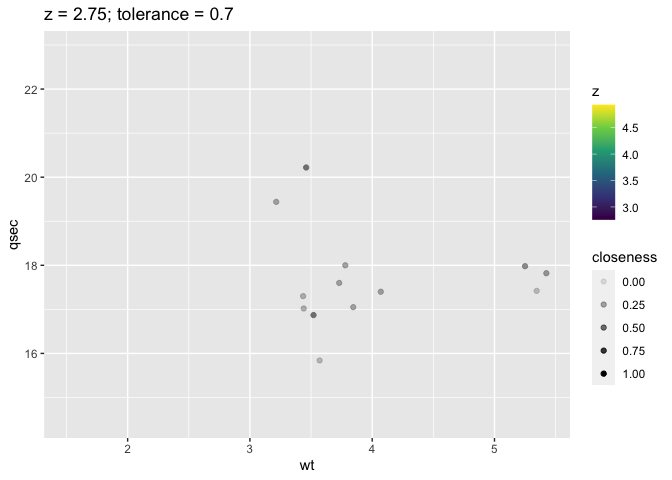
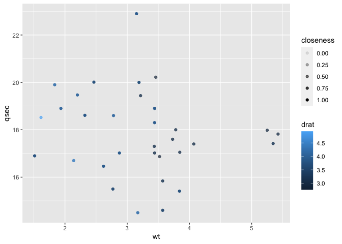
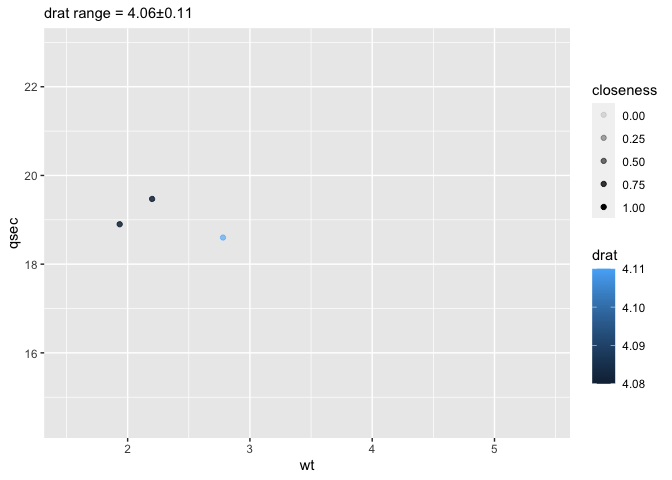
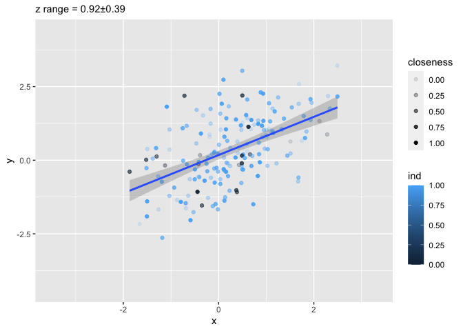
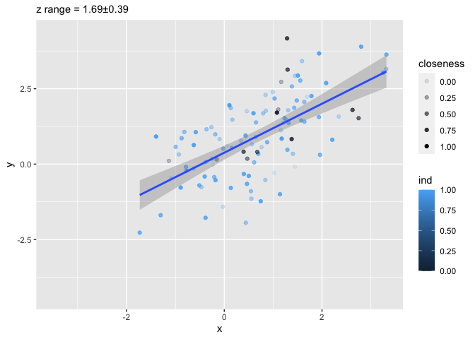
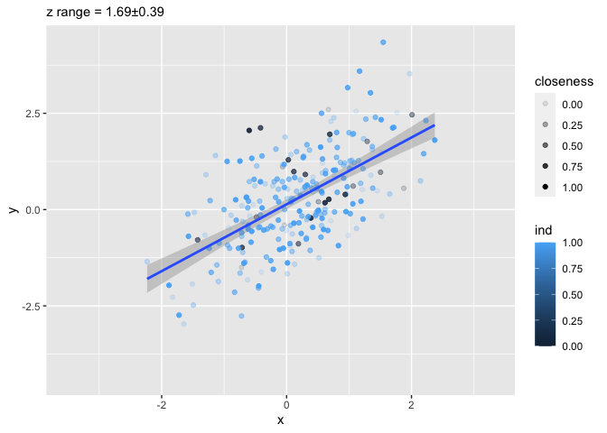

<!-- README.md is generated from README.Rmd. Please edit that file -->

# ggslice

<!-- badges: start -->

<!-- badges: end -->

The goal of ggslice is to …

## Installation

You can install the development version of ggslice from
[GitHub](https://github.com/) with:

``` r
# install.packages("devtools")
devtools::install_github("EvaMaeRey/ggslice")
```

## Example

This is a basic example which shows you how to solve a common problem:

``` r
library(ggslice)
## basic example code
```

What is special about using `README.Rmd` instead of just `README.md`?
You can include R chunks like so:

``` r
library(tidyverse)
#> ── Attaching core tidyverse packages ─────────────────── tidyverse 2.0.0.9000 ──
#> ✔ dplyr     1.1.0     ✔ readr     2.1.4
#> ✔ forcats   1.0.0     ✔ stringr   1.5.0
#> ✔ ggplot2   3.4.1     ✔ tibble    3.2.1
#> ✔ lubridate 1.9.2     ✔ tidyr     1.3.0
#> ✔ purrr     1.0.1     
#> ── Conflicts ────────────────────────────────────────── tidyverse_conflicts() ──
#> ✖ dplyr::filter() masks stats::filter()
#> ✖ dplyr::lag()    masks stats::lag()
#> ℹ Use the conflicted package (<http://conflicted.r-lib.org/>) to force all conflicts to become errors
z <- 2.75
tolerance <- .7
mtcars %>% 
  filter(drat < z + tolerance & drat > z - tolerance) %>% 
  mutate(closeness = (tolerance - abs(z- drat))/tolerance) %>% 
  ggplot() + 
  aes(wt, qsec) + 
  geom_point(aes(alpha = closeness, color = z)) + 
  labs(title = paste0("z = ", z,"; tolerance = ",  tolerance)) +
  scale_alpha(limits = c(0, 1)) +
  geom_blank(data = mtcars) + 
  scale_color_viridis_c(limits = range(mtcars$drat))
```



``` r
counter <- 1
```

``` r
slice_z <- function(data, z, 
                    z_q_range = .5, # middle of the range
                    z_value = NULL, 
                    tolerance = .05, # plus or minus 5% of range
                    tol_value = NULL){
  
z_vector <- data |> pull({{z}})  
z_range <- range(z_vector, na.rm = T)
z_name <- data  |>  select({{z}}) |> names()
  
if(is.null(z_value)){     z_value <-  quantile(z_range, z_q_range)}
if(is.null(tol_value)){ tol_value <- (z_range[2]-z_range[1])*tolerance}

z_min <- z_value - tol_value
z_max <- z_value + tol_value
  
data %>% 
  dplyr::filter({{z}} <= z_max & {{z}} >= z_min) |> 
  dplyr::mutate(closeness = (tol_value - abs(z_value - {{z}}))/tol_value) 

}


#' Title
#'
#' @param data 
#' @param z 
#' @param z_q_range 
#' @param z_value 
#' @param tolerance 
#' @param tol_value 
#'
#' @return
#' @export
#'
#' @examples
ggslice <- function(data, z, 
                    z_q_range = .5, # middle of the range
                    z_value = NULL, 
                    tolerance = .05, # plus or minus 5% of range
                    tol_value = NULL){
  
z_vector <- data |> pull({{z}})  
z_range <- range(z_vector, na.rm = T)
z_name <- data  |>  select({{z}}) |> names()
  
if(is.null(z_value)){z_value <- z_range |> quantile(z_q_range)}
if(is.null(tol_value)){tol_value <- (z_range[2]-z_range[1])*tolerance}

z_min <- z_value - tol_value
z_max <- z_value + tol_value
  
data %>% 
  dplyr::filter({{z}} <= z_max & {{z}} >= z_min) |> 
  dplyr::mutate(closeness = (tol_value - abs(z_value - {{z}}))/tol_value)  ->
sliced
  
sliced |>
  ggplot2::ggplot() + 
  ggplot2::geom_blank(data = data) + 
  ggplot2::labs(subtitle = paste0(z_name, " range = ", 
                                  round(z_value, 2),"\u00B1",  
                                  round(tol_value,2))) +
  # scale_color_viridis_c(limits = range(z_complete, na.rm = T)) + 
  NULL
  
}
```

# Test it out

``` r
ggslice(mtcars, z = drat) + 
  aes(x = wt, y = qsec) + 
  geom_point(aes(alpha = closeness, color = drat)) +
  # labs(title = paste0("z = ", z,"; tolerance = ",  tolerance)) +
  scale_alpha(limits = c(0, 1)) +
  geom_blank(data = mtcars) 
```



``` r

ggslice(mtcars, z = drat, z_q_range = .6) + 
  aes(x = wt, y = qsec) + 
  geom_point(aes(alpha = closeness, color = drat)) +
  # labs(title = paste0("z = ", z,"; tolerance = ",  tolerance)) +
  scale_alpha(limits = c(0, 1)) +
  geom_blank(data = mtcars) 
```



``` r
library(tidyverse)
df <- tibble(x = rnorm(1000)) |>
  mutate(y = x + rnorm(1000) , z = .2*x + .3*y + rnorm(1000), 
                 ind = sample(0:1, 1000, replace = T, prob = c(.1, .9)))

ggslice(df, z = z) + 
  aes(x = x, y = y) + 
  geom_point(aes(alpha = closeness, color = ind)) +
  scale_alpha(limits = c(0, 1)) + 
  geom_smooth(method = lm)
#> `geom_smooth()` using formula = 'y ~ x'


ggslice(df, z = z, z_q_range = .6) + 
  aes(x = x, y = y) + 
  geom_point(aes(alpha = closeness, 
                 color = ind)) +
  scale_alpha(limits = c(0, 1)) + 
  geom_smooth(method = lm)
#> `geom_smooth()` using formula = 'y ~ x'

ggslice(df, z = z, z_q_range = .7) + 
  aes(x = x, y = y) + 
  geom_point(aes(alpha = closeness, color = ind)) +
  scale_alpha(limits = c(0, 1)) + 
  geom_smooth(method = lm)
#> `geom_smooth()` using formula = 'y ~ x'
```



``` r
# last_plot_new_slice()

last_plot() %+% slice_z(df, z = z)
#> `geom_smooth()` using formula = 'y ~ x'
```



``` r
readme2pkg::chunk_to_r("ggslice")
```

``` r
devtools::check()
usethis::use_package("ggplot2")
usethis::use_package("dplyr")
devtools::build()
```
